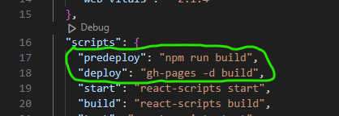
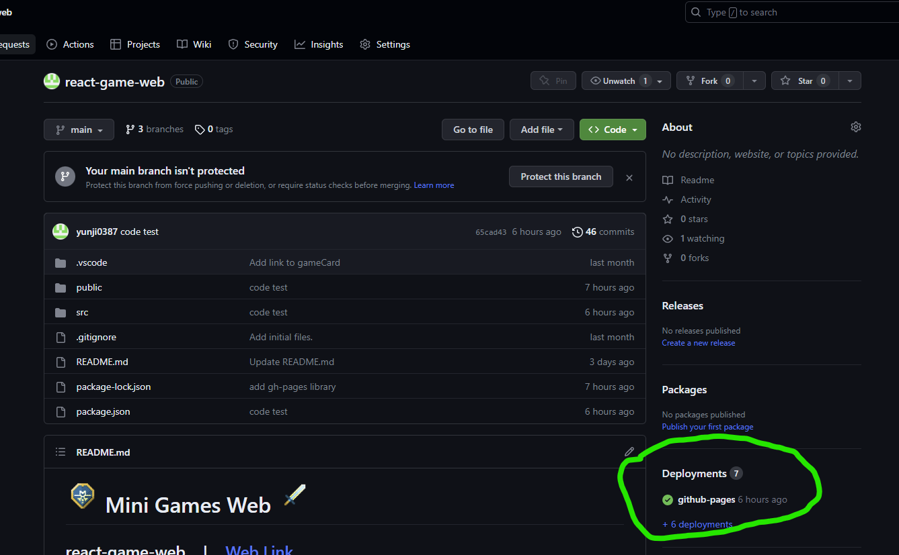

# React Commands

## How to create & run first React App
<details close>
<summary><b>(click to expand/hide)</b></summary>
<!-- MarkdownTOC -->

### Creating React App
<details close>
<summary><b>(click to expand/hide)</b></summary>
<!-- MarkdownTOC -->

- In bash
    ```bash
      npx create-react-app <app name>
    ```

<!-- /MarkdownTOC -->
</details>

### Start development server
<details close>
<summary><b>(click to expand/hide)</b></summary>
<!-- MarkdownTOC -->

- In bash located into the react app directory
    ```bash
      cd <app name>
    ```
    ```bash
      npm start
    ```

<!-- /MarkdownTOC -->
</details>

### Upgrade React App version
<details close>
<summary><b>(click to expand/hide)</b></summary>
<!-- MarkdownTOC -->

- In bash located into the react app directory
    ```bash
      cd <app name>
    ```
    ```bash
      npm install react-scripts@latest
    ```

<!-- /MarkdownTOC -->
</details>

<!-- /MarkdownTOC -->
</details>

### React 101
<details close>
<summary><b>(click to expand/hide)</b></summary>
<!-- MarkdownTOC -->

#### Import libraries in js file
<details close>
<summary><b>(click to expand/hide)</b></summary>
<!-- MarkdownTOC -->

```javascript
import React from 'react';
import ReactDOM from 'react-dom/client';
```

<!-- /MarkdownTOC -->
</details>

#### Inject code to an element (ex. div/h1/p)
<details close>
<summary><b>(click to expand/hide)</b></summary>
<!-- MarkdownTOC -->

```javascript
import React from 'react';
import ReactDOM from 'react-dom/client';

const root = ReactDOM.createRoot(document.getElementById('root'));
root.render(
  <h1>
    Hello World
  </h1>
);

```

<!-- /MarkdownTOC -->
</details>

#### Calling js variable in an element (ex. div/h1/p)
<details close>
<summary><b>(click to expand/hide)</b></summary>
<!-- MarkdownTOC -->

```javascript
import React from "react";

function Footer() {
  const currentYear = new Date().getFullYear();
  return (
    <footer>
      <p>Copyright ⓒ {currentYear}</p>
    </footer>
  );
}

export default Footer;
```

<!-- /MarkdownTOC -->
</details>

#### React function with parameter (React props)
<details close>
<summary><b>(click to expand/hide)</b></summary>
<!-- MarkdownTOC -->

```javascript
import React from "react";
import ReactDOM from "react-dom";

function Card(props) {
  return (
    <div>
      <h2>{props.name}</h2>
      
      <p>{props.tel}</p>
      <p>{props.email}</p>
    </div>
  );
}

const root = ReactDOM.createRoot(document.getElementById('root'));
root.render(
  <div>
    <h1>My Contacts</h1>
    <Card
      name="Beyonce"
      img="https://blackhistorywall.files.wordpress.com/2010/02/picture-device-independent-bitmap-119.jpg"
      tel="+123 456 789"
      email="b@beyonce.com"
    />
    <Card
      name="Jack Bauer"
      img="https://pbs.twimg.com/profile_images/625247595825246208/X3XLea04_400x400.jpg"
      tel="+7387384587"
      email="jack@nowhere.com"
    />
  </div>,
  document.getElementById("root")
);

```

<!-- /MarkdownTOC -->
</details>

#### useState function
<details close>
<summary><b>(click to expand/hide)</b></summary>
<!-- MarkdownTOC -->

- const [state, setState] = useState(initialState);
    ```javascript
    import React, { useState } from "react";
    
    function App() {
      const [count, setCount] = useState(0);
    
      function increase() {
        setCount(count + 1);
      }
    
      function decrease() {
        setCount(count - 1);
      }
    
      return (
        <div className="container">
          <h1>{count}</h1>
          <button onClick={decrease}>-</button>
          <button onClick={increase}>+</button>
        </div>
      );
    }
    
    export default App;
    ```

<!-- /MarkdownTOC -->
</details>

#### Appending element into a state array
<details close>
<summary><b>(click to expand/hide)</b></summary>
<!-- MarkdownTOC -->

```javascript
  const [inputText, setInputText] = useState("");
  const [items, setItems] = useState([]);

  function handleChange(event) {
    const newValue = event.target.value;
    setInputText(newValue);
  }

  function addItem() {
    setItems(prevItems => {
      return [...prevItems, inputText];
    });
    setInputText("");
  }
```

<!-- /MarkdownTOC -->
</details>

#### Adding link to a react component
<details close>
<summary><b>(click to expand/hide)</b></summary>
<!-- MarkdownTOC -->

1. First install react-router-dom
    ```bash
    npm install react-router-dom
    ```
2. In index.js import BrowserRouter
    ```javascript
    import React from 'react';
    import ReactDOM from 'react-dom/client';
    import { BrowserRouter } from 'react-router-dom'
    import App from './App';

    const root = ReactDOM.createRoot(document.getElementById('root'));
    root.render(
        <BrowserRouter>
          <App />
        </BrowserRouter>
    );
    ```
4. Finally add <Link> to the desired react component
   ```javascript
    import React from 'react';
    import { Link } from 'react-router-dom';
    import './GameCard.css';
    
    const GameCard = (props) => {
      return (
        <Link to='/about' className="game-card">
          
          <div className="game-card__details">
            <h2 className="game-card__title">{props.title}</h2>
            <p className="game-card__description">{props.description}</p>
          </div>
        </Link>
      );
    };
    
    export default GameCard;
    ```

<!-- /MarkdownTOC -->
</details>

---

<!-- /MarkdownTOC -->
</details>

### Deploy react app as github pages
<details close>
<summary><b>(click to expand/hide)</b></summary>
<!-- MarkdownTOC -->

1. Make sure to have the react app push to GitHub
2. install npm packages : gh-pages
   ```bash
   npm install gh-pages
   ```
4. on package.json, include:
   - "homepage" path on top of the json
     ```json
     "homepage": "https://<GitHub usersame>.github.io/<repository name>/#"
     ```
     
   - "predeploy" and "deploy" on "script"
     ```json
     "predeploy": "npm run build",
     "deploy": "gh-pages -d build",
     ```
     
5. If your react app does not use any Route or Anchor tag, please jump to step 7.
   - install react-router-dom if not already installed
     ```bash
      npm install react-router-dom
     ```
6. On App.js, add or replace "BrowserRouter/Router" with HashRouter
   - there is nothing need to be change on Route path or Anchor tag path, path can just start with "/"
   ```js
    import React from 'react';
    import { HashRouter, Routes, Route } from 'react-router-dom';
    import Home from './pages/Home';
    import About from './pages/About';
    import './App.css';
    
    function App() {
      return (
        <HashRouter basename='/'>
            <Routes>
              <Route exact path='/' element={<Home />} />
              <Route path='/about' element={<About />} />
            </Routes>
        </HashRouter>
      );
    }
    
    export default App;
   ```
7. Push your code to GitHub if you have not already.
8. On bash, run:
   ```bash
   npm run deploy
   ```
9. After step 8 your react app is starting to deploy to GitHub pages, please wait a few moments.
   
11. I have experienced very slow deployment on my GitHub pages, and looking online for solution I have found this, but I do not know if this solution helps speed up the deployment process at all.
  - On public/index.html, add these meta tags:
    ```html
    <meta http-equiv='cache-control' content='no-cache'>
    <meta http-equiv='expires' content='0'>
    <meta http-equiv='pragma' content='no-cache'>
    ```
   - Sources I looked at: [source1](https://github.com/orgs/community/discussions/19713), [source2](https://stackoverflow.com/questions/24851824/how-long-does-it-take-for-github-page-to-show-changes-after-changing-index-html)
12. Sources (If you still have troubles these links may help):
    - [Deploying Github Pages with create-react-app](https://www.pluralsight.com/guides/deploying-github-pages-with-create-react-app)
    -  [Deploying a create-react-app with routing to GitHub pages](https://medium.com/@bennirus/deploying-a-create-react-app-with-routing-to-github-pages-f386b6ce84c2)
    -  [Question: React Router not working with Github Pages](https://stackoverflow.com/questions/71984401/react-router-not-working-with-github-pages)
    -  [Question: My github webpage is not updating after changes are made.](https://github.com/orgs/community/discussions/19713)
     - [Question: How long does it take for GitHub page to show changes after changing index.html](https://stackoverflow.com/questions/24851824/how-long-does-it-take-for-github-page-to-show-changes-after-changing-index-html)

<!-- /MarkdownTOC -->
</details>


## External Libraries
### Form (Formik)
- [Formik Tutorial](https://formik.org/docs/tutorial)

### Prebuilt Components (Chakra UI) 
- Chakra UI provides prebuilt components to help you build your projects faster.
- [Documentation](https://chakra-ui.com/docs/components)

### Input Autocomplete (Material UI)
- [Documentation](https://mui.com/material-ui/react-autocomplete/)
