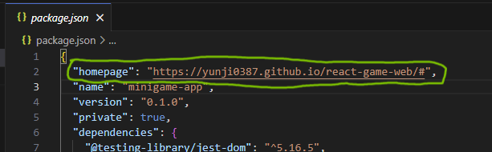

# React Commands

## Deploy react app as github pages
1. Make sure to have the react app push to GitHub
2. install npm packages : gh-pages
   ```bash
   npm install gh-pages
   ```
4. on package.json, include:
   - "homepage" path on top of the json
     ```json
     "homepage": "https://<GitHub usersame>.github.io/<repository name>/#"
     ```
     
   - "predeploy" and "deploy" on "script"
     ```json
     "predeploy": "npm run build",
     "deploy": "gh-pages -d build",
     ```
     
5. If your react app does not use any Route or Anchor tag, please jump to step 7.
   - install react-router-dom if not already installed
     ```bash
      npm install react-router-dom
     ```
6. On App.js, add or replace "BrowserRouter/Router" with HashRouter
   - there is nothing need to be change on Route path or Anchor tag path, path can just start with "/"
   ```js
    import React from 'react';
    import { HashRouter, Routes, Route } from 'react-router-dom';
    import Home from './pages/Home';
    import About from './pages/About';
    import './App.css';
    
    function App() {
      return (
        <HashRouter basename='/'>
            <Routes>
              <Route exact path='/' element={<Home />} />
              <Route path='/about' element={<About />} />
            </Routes>
        </HashRouter>
      );
    }
    
    export default App;
   ```
7. Push your code to GitHub if you have not already.
8. On bash, run:
   ```bash
   npm run deploy
   ```
9. After step 8 your react app is starting to deploy to GitHub pages, please wait a few moments.
   
11. I have experienced very slow deployment on my GitHub pages, and looking online for solution I have found this, but I do not know if this solution helps speed up the deployment process at all.
  - On public/index.html, add these meta tags:
    ```html
    <meta http-equiv='cache-control' content='no-cache'>
    <meta http-equiv='expires' content='0'>
    <meta http-equiv='pragma' content='no-cache'>
    ```
   - Sources I looked at: [source1](https://github.com/orgs/community/discussions/19713), [source2](https://stackoverflow.com/questions/24851824/how-long-does-it-take-for-github-page-to-show-changes-after-changing-index-html)
12. Sources (If you still have troubles these links may help):
    - [Deploying Github Pages with create-react-app](https://www.pluralsight.com/guides/deploying-github-pages-with-create-react-app)
    -  [Deploying a create-react-app with routing to GitHub pages](https://medium.com/@bennirus/deploying-a-create-react-app-with-routing-to-github-pages-f386b6ce84c2)
    -  [Question: React Router not working with Github Pages](https://stackoverflow.com/questions/71984401/react-router-not-working-with-github-pages)
    -  [Question: My github webpage is not updating after changes are made.](https://github.com/orgs/community/discussions/19713)
     - [Question: How long does it take for GitHub page to show changes after changing index.html](https://stackoverflow.com/questions/24851824/how-long-does-it-take-for-github-page-to-show-changes-after-changing-index-html)

- React gh-pages take too long to deploy
  ```html
  <meta http-equiv='cache-control' content='no-cache'> 
  <meta http-equiv='expires' content='0'> 
  <meta http-equiv='pragma' content='no-cache'>
  ```
  - https://github.com/orgs/community/discussions/19713
  - https://stackoverflow.com/questions/24851824/how-long-does-it-take-for-github-page-to-show-changes-after-changing-index-html

formik tutorial
- https://formik.org/docs/tutorial
